# NPC Threat Score — Calibration EDA

_A seven-section narrative covering data quality, distributions, relationships, stratification, and calibration recommendations._

## 1. Frame

> What's in the dataset and what we're trying to answer.

The NPC Threat Score (NTS) rates Cyberpunk RED NPCs against player characters on a 1–20 scale. Each row in the dataset is a single (PC, NPC) matchup; OTS depends on the specific defender, while DDS and the Complexity Multiplier depend only on the NPC. This report follows a Tukey-style EDA progression (Profile → Distribute → Relate → Stratify → Diagnose → Recommend) tied to the open calibration parameters in [`docs/outline.md`](../../docs/outline.md).

- **Row grain**: one row per (PC, NPC) pair
- **Total (PC, NPC) pairs**: 1600
- **Unique PCs**: 16 (7 roles)
- **Unique NPCs**: 100
- **Factions represented**: 15
- **Rarity tiers**: Mook → Tough → HardenedMook → HardenedLieutenant → Elite → HardenedMiniBoss → Boss → HardenedBoss
- **Clean-data join**: 84/100 NPCs matched (84%)

## 2. Profile

> Data quality, completeness, and invariant checks.

### Null rates

_Per-column null rate. Calculated columns should be 0; clean-data joins may be partial._

| index        | null_rate | null_count |
| ------------ | --------- | ---------- |
| pc_role_id   | 0.000     | 0          |
| pc_role      | 0.000     | 0          |
| npc_id       | 0.000     | 0          |
| faction      | 0.000     | 0          |
| npc_name     | 0.000     | 0          |
| npc_rarity   | 0.030     | 48         |
| nts_raw      | 0.000     | 0          |
| cm           | 0.000     | 0          |
| ots          | 0.000     | 0          |
| hpw_ss       | 0.000     | 0          |
| edpr_ss      | 0.000     | 0          |
| cts_ss       | 0.000     | 0          |
| hpw_af       | 0.780     | 1248       |
| edpr_af      | 0.780     | 1248       |
| cts_af       | 0.780     | 1248       |
| has_autofire | 0.000     | 0          |
| weapon_type  | 0.000     | 0          |
| is_excellent | 0.000     | 0          |
| attack_pool  | 0.000     | 0          |
| af_pool      | 0.780     | 1248       |
| range_dv     | 0.000     | 0          |
| def_static   | 0.000     | 0          |
| def_ref      | 0.000     | 0          |
| def_sp       | 0.000     | 0          |
| dds          | 0.000     | 0          |

_...showing first 25 of 39 rows. Full table: [tables/profile_nulls.csv](tables/profile_nulls.csv)_

### Cardinality

_Distinct values per column._

| index        | distinct |
| ------------ | -------- |
| pc_role_id   | 16       |
| pc_role      | 7        |
| npc_id       | 100      |
| faction      | 15       |
| npc_name     | 100      |
| npc_rarity   | 8        |
| nts_raw      | 263      |
| cm           | 1        |
| ots          | 109      |
| hpw_ss       | 16       |
| edpr_ss      | 11       |
| cts_ss       | 7        |
| hpw_af       | 8        |
| edpr_af      | 1        |
| cts_af       | 1        |
| has_autofire | 2        |
| weapon_type  | 14       |
| is_excellent | 2        |
| attack_pool  | 13       |
| af_pool      | 6        |
| range_dv     | 4        |
| def_static   | 9        |
| def_ref      | 6        |
| def_sp       | 3        |
| dds          | 54       |

_...showing first 25 of 39 rows. Full table: [tables/profile_cardinality.csv](tables/profile_cardinality.csv)_

### Rarity tier counts

| npc_rarity         | unique_npcs |
| ------------------ | ----------- |
| Mook               | 18          |
| Tough              | 12          |
| HardenedMook       | 10          |
| HardenedLieutenant | 8           |
| Elite              | 33          |
| HardenedMiniBoss   | 5           |
| Boss               | 9           |
| HardenedBoss       | 2           |

_Source: [tables/profile_rarity_counts.csv](tables/profile_rarity_counts.csv)_

### Integrity checks

- **[PASS]** DDS is constant per NPC across PCs — 0 NPC(s) showed varying DDS — should be 0
- **[PASS]** OTS varies across PCs for most NPCs — 4/100 NPCs deliver identical OTS to every PC
- **[PASS]** NTS_raw == (OTS·0.6 + DDS·0.4) · CM — max |delta| = 0.0000

## 3. Distribute

> Univariate distributions of every metric and subcomponent.

_Per-metric summary including skewness, excess kurtosis, and zero-mass fraction._

| metric  | n    | mean    | median  | std    | min    | p05    | p95     | max     | skewness | ex_kurtosis | zero_frac |
| ------- | ---- | ------- | ------- | ------ | ------ | ------ | ------- | ------- | -------- | ----------- | --------- |
| nts_raw | 1600 | 42.516  | 45.601  | 19.819 | 12.373 | 13.751 | 82.055  | 97.691  | 0.553    | 0.054       | 0.000     |
| ots     | 1600 | 2.610   | 0.793   | 3.701  | 0.000  | 0.119  | 8.816   | 25.230  | 2.336    | 6.566       | 0.040     |
| dds     | 1600 | 102.374 | 110.799 | 48.031 | 30.600 | 33.100 | 198.602 | 243.782 | 0.588    | 0.163       | 0.000     |
| hpp     | 1600 | 36.475  | 35.000  | 8.189  | 22.500 | 25.000 | 55.125  | 67.500  | 1.378    | 2.588       | 0.000     |
| aac     | 1600 | 61.270  | 75.000  | 38.022 | 7.000  | 7.000  | 135.000 | 150.000 | 0.244    | -0.579      | 0.000     |
| dsr_hp  | 1600 | 4.630   | 2.732   | 4.962  | 1.100  | 1.100  | 19.324  | 26.282  | 2.587    | 6.204       | 0.000     |
| hpw_ss  | 1600 | 0.726   | 0.800   | 0.281  | 0.200  | 0.200  | 1.000   | 1.000   | -0.711   | -0.903      | 0.000     |
| edpr_ss | 1600 | 2.736   | 0.000   | 4.225  | 0.000  | 0.000  | 13.000  | 21.000  | 1.609    | 2.409       | 0.632     |
| cts_ss  | 1600 | 1.332   | 1.412   | 0.910  | 0.000  | 0.297  | 2.817   | 4.230   | 1.238    | 1.389       | 0.040     |

_Source: [tables/univariate_summary.csv](tables/univariate_summary.csv)_

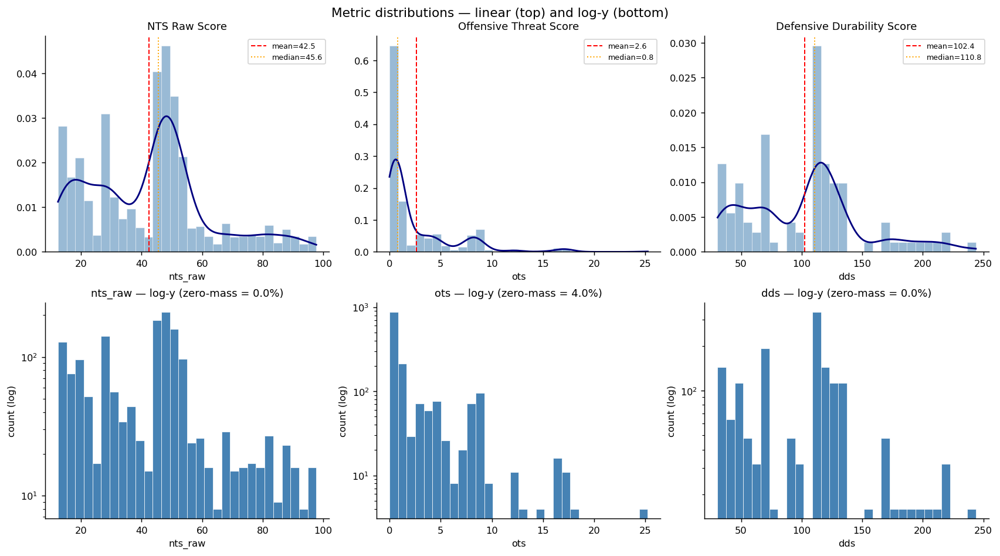

_Linear (top) and log-y (bottom) histograms. The OTS log-y plot exposes the heavy zero-mass. Many NPCs cannot penetrate PC armor in single-shot mode._

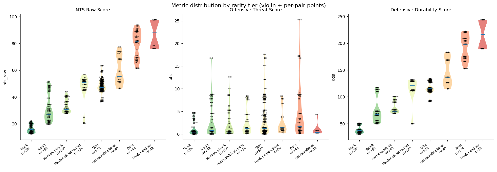

_Violin shape + per-pair points per rarity tier. Wide tails indicate within-tier variance; per-tier n is on the x-axis._

## 4. Relate

> Pairwise and multivariate relationships across metrics + subcomponents.

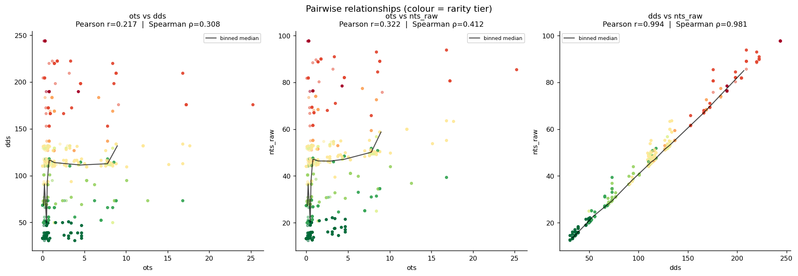

_Pearson (linear) and Spearman (monotonic) correlations side-by-side. NTS_raw is dominated by DDS due to the Armor Absorption Capacity (AAC) calculation. As SP rating increases the armor absorption pool quadratically increases._

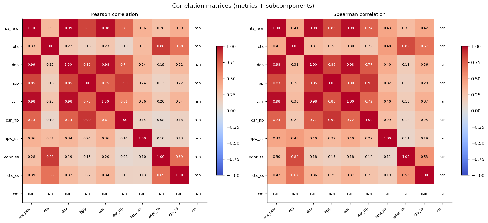

_Pearson catches linear correlation and Spearman captures monotonic rank relationships. The heavily-tailed OTS distribution currently makes Spearman the more honest summary._

_Spearman correlation matrix._

| index   | nts_raw | ots   | dds   | hpp   | aac   | dsr_hp | hpw_ss | edpr_ss | cts_ss | cm |
| ------- | ------- | ----- | ----- | ----- | ----- | ------ | ------ | ------- | ------ | -- |
| nts_raw | 1.000   | 0.412 | 0.983 | 0.831 | 0.980 | 0.742  | 0.433  | 0.297   | 0.419  |    |
| ots     | 0.412   | 1.000 | 0.310 | 0.281 | 0.302 | 0.220  | 0.480  | 0.825   | 0.669  |    |
| dds     | 0.983   | 0.310 | 1.000 | 0.848 | 0.983 | 0.769  | 0.397  | 0.185   | 0.360  |    |
| hpp     | 0.831   | 0.281 | 0.848 | 1.000 | 0.804 | 0.896  | 0.315  | 0.154   | 0.287  |    |
| aac     | 0.980   | 0.302 | 0.983 | 0.804 | 1.000 | 0.720  | 0.398  | 0.180   | 0.373  |    |
| dsr_hp  | 0.742   | 0.220 | 0.769 | 0.896 | 0.720 | 1.000  | 0.291  | 0.124   | 0.254  |    |
| hpw_ss  | 0.433   | 0.480 | 0.397 | 0.315 | 0.398 | 0.291  | 1.000  | 0.108   | 0.194  |    |
| edpr_ss | 0.297   | 0.825 | 0.185 | 0.154 | 0.180 | 0.124  | 0.108  | 1.000   | 0.531  |    |
| cts_ss  | 0.419   | 0.669 | 0.360 | 0.287 | 0.373 | 0.254  | 0.194  | 0.531   | 1.000  |    |
| cm      |         |       |       |       |       |        |        |         |        |    |

_Source: [tables/correlations_spearman.csv](tables/correlations_spearman.csv)_

## 5. Stratify

> Conditional analysis by rarity tier, PC role, and faction.

### Per-rarity summary

_The mean for the nts_raw score highlights the lack of gradation within the pre-defined stat blocks. This results in 'spikey' difficulty ratings instead of a normalized increase._

| ('npc_rarity', '') | ('nts_raw', 'mean') | ('nts_raw', 'median') | ('nts_raw', 'std') | ('ots', 'mean') | ('ots', 'median') | ('ots', 'std') | ('dds', 'mean') | ('dds', 'median') | ('dds', 'std') | ('n_pairs', '') | ('n_unique_npcs', '') |
| ------------------ | ------------------- | --------------------- | ------------------ | --------------- | ----------------- | -------------- | --------------- | ----------------- | -------------- | --------------- | --------------------- |
| Mook               | 16.300              | 15.870                | 2.850              | 1.040           | 0.480             | 1.360          | 39.190          | 37.580            | 6.730          | 288             | 18                    |
| Tough              | 31.640              | 27.350                | 10.160             | 2.780           | 0.790             | 3.630          | 74.930          | 67.120            | 23.990         | 192             | 12                    |
| HardenedMook       | 33.090              | 30.790                | 4.970              | 2.240           | 0.480             | 3.280          | 79.370          | 73.230            | 10.910         | 160             | 10                    |
| HardenedLieutenant | 46.720              | 50.700                | 9.970              | 2.400           | 1.270             | 2.700          | 113.190         | 121.030           | 25.470         | 128             | 8                     |
| Elite              | 48.400              | 47.160                | 4.890              | 3.120           | 1.270             | 3.900          | 116.310         | 115.230           | 9.760          | 528             | 33                    |
| HardenedMiniBoss   | 59.990              | 55.200                | 10.610             | 2.520           | 1.380             | 2.690          | 146.200         | 136.820           | 25.930         | 80              | 5                     |
| Boss               | 79.510              | 81.870                | 10.030             | 5.020           | 1.760             | 6.210          | 191.250         | 198.300           | 23.720         | 144             | 9                     |
| HardenedBoss       | 87.280              | 88.040                | 10.590             | 0.970           | 0.370             | 1.300          | 216.750         | 216.750           | 27.460         | 32              | 2                     |

_Source: [tables/rarity_breakdown.csv](tables/rarity_breakdown.csv)_

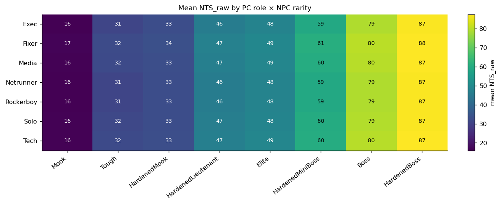

_Mean NTS_raw per (PC role, NPC rarity) cell. Row variation reveals whether some PC roles face systematically harder or easier matchups than others. Insight into the similarity ratings between roles is provided with the next table._

### Per-PC-role summary

_The stat blocks extracted from the Danger Girl Dossier are essentially equal in terms of combat prowess. The un-answered question is, 'how does each role compare to an actual PC character within the same role?'_

| pc_role   | n_pairs | median_nts_raw | mean_nts_raw | median_ots | ots_zero_frac |
| --------- | ------- | -------------- | ------------ | ---------- | ------------- |
| Fixer     | 200     | 45.940         | 43.140       | 1.661      | 0.460         |
| Media     | 300     | 45.860         | 42.750       | 0.895      | 0.573         |
| Tech      | 300     | 45.860         | 42.750       | 0.895      | 0.573         |
| Solo      | 400     | 45.300         | 42.390       | 0.713      | 0.640         |
| Exec      | 100     | 45.070         | 41.970       | 0.713      | 0.800         |
| Rockerboy | 100     | 45.070         | 41.970       | 0.713      | 0.800         |
| Netrunner | 200     | 45.070         | 41.970       | 0.713      | 0.800         |

_Source: [tables/pc_role_breakdown.csv](tables/pc_role_breakdown.csv)_

### Per-faction summary

_NTS_raw by faction. A faction whose median sits sharply above its peers may indicate stat-block drift in that gang's design._

| faction       | n_pairs | n_unique_npcs | median_nts_raw | mean_nts_raw | std_nts_raw |
| ------------- | ------- | ------------- | -------------- | ------------ | ----------- |
| Piranhas      | 48      | 3             | 61.610         | 60.370       | 18.780      |
| Zoners        | 160     | 10            | 49.010         | 47.330       | 25.440      |
| TeamMonster   | 96      | 6             | 47.580         | 50.180       | 5.460       |
| Maelstrom     | 176     | 11            | 47.560         | 53.430       | 25.180      |
| Sightseers    | 80      | 5             | 47.020         | 36.490       | 17.570      |
| 6thStreet     | 80      | 5             | 46.920         | 42.180       | 11.590      |
| DangerGal     | 80      | 5             | 46.570         | 45.770       | 5.740       |
| Bozos         | 176     | 11            | 46.280         | 47.360       | 18.220      |
| NCPD          | 176     | 11            | 45.940         | 46.920       | 10.980      |
| TygerClaws    | 144     | 9             | 45.600         | 41.060       | 25.670      |
| TraumaTeam    | 96      | 6             | 38.920         | 38.180       | 9.560       |
| Incident      | 32      | 2             | 38.860         | 37.630       | 16.150      |
| Network54     | 48      | 3             | 27.270         | 27.800       | 1.560       |
| DigitalDivas  | 80      | 5             | 21.890         | 23.360       | 3.240       |
| GenerationRed | 128     | 8             | 15.870         | 21.870       | 9.730       |

_Source: [tables/faction_breakdown.csv](tables/faction_breakdown.csv)_

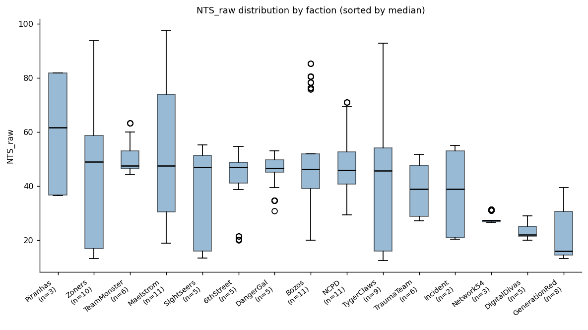

_Per-faction NTS_raw distribution, sorted by median._

## 6. Diagnose

> Calibration findings tied to outline.md's open parameters.

### Tier separation

_Cohen's d, distribution overlap %, and Mann-Whitney p between adjacent tiers. For example, a negative d would signal an inverted ladder meaning the higher-rarity tier is actually weaker._

| index | lower              | higher             | n_lo | n_hi | mean_lo | mean_hi | cohen_d | overlap_pct | mw_p  |
| ----- | ------------------ | ------------------ | ---- | ---- | ------- | ------- | ------- | ----------- | ----- |
| 0     | Mook               | Tough              | 288  | 192  | 16.300  | 31.640  | 2.259   | 5.300       | 0.000 |
| 1     | Tough              | HardenedMook       | 192  | 160  | 31.640  | 33.090  | 0.177   | 74.000      | 0.000 |
| 2     | HardenedMook       | HardenedLieutenant | 160  | 128  | 33.090  | 46.720  | 1.791   | 25.000      | 0.000 |
| 3     | HardenedLieutenant | Elite              | 128  | 528  | 46.720  | 48.400  | 0.271   | 100.000     | 0.990 |
| 4     | Elite              | HardenedMiniBoss   | 528  | 80   | 48.400  | 59.990  | 1.946   | 33.500      | 0.000 |
| 5     | HardenedMiniBoss   | Boss               | 80   | 144  | 59.990  | 79.510  | 1.906   | 23.400      | 0.000 |
| 6     | Boss               | HardenedBoss       | 144  | 32   | 79.510  | 87.280  | 0.766   | 66.000      | 0.001 |

_Source: [tables/tier_separation.csv](tables/tier_separation.csv)_

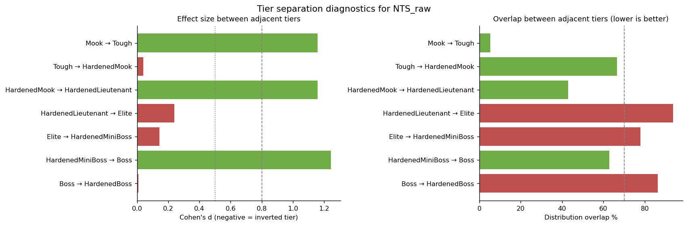

_Green = clean separation (|d|≥0.8 or overlap<70%), orange = moderate, red = at-risk. There is very little variation between two tiers (Tough -> Hardened & HardenedLT -> Elite) and the variation between Boss -> HardenedBoss is moderately overlapping. This is likely a result of poor stat block balancing by the stat block's authors._

### SCALE_FACTOR back-solve

Best `SCALE_FACTOR` ≈ **5.00** (score 75% — fraction of anchor tiers landing in their target NTS bands).

_Where each rarity tier's median NTS_raw lands under the best SCALE_FACTOR._

| index | rarity             | median_raw | target_band | mapped_nts | in_band |
| ----- | ------------------ | ---------- | ----------- | ---------- | ------- |
| 0     | Mook               | 15.870     | 1-4         | 3          | True    |
| 1     | Tough              | 27.350     | 1-4         | 5          | False   |
| 2     | HardenedMook       | 30.790     | 5-8         | 6          | True    |
| 3     | HardenedLieutenant | 50.700     | 5-8         | 10         | False   |
| 4     | Elite              | 47.160     | 9-12        | 9          | True    |
| 5     | HardenedMiniBoss   | 55.200     | 9-12        | 11         | True    |
| 6     | Boss               | 81.870     | 13-16       | 16         | True    |
| 7     | HardenedBoss       | 88.040     | 17-20       | 18         | True    |

_Source: [tables/scale_factor_landing.csv](tables/scale_factor_landing.csv)_

### Subcomponent decomposition

_Fraction of mean DDS from each component (HPP/AAC/DSR) and OTS from each track (raw damage vs crit threat) within each rarity tier._

| npc_rarity         | n_pairs | hpp_share | aac_share | dsr_share | edpr_share | cts_share | mean_ots | mean_dds |
| ------------------ | ------- | --------- | --------- | --------- | ---------- | --------- | -------- | -------- |
| Mook               | 288     | 0.723     | 0.231     | 0.046     | 0.619      | 0.381     | 1.039    | 39.190   |
| Tough              | 192     | 0.473     | 0.488     | 0.039     | 0.691      | 0.309     | 2.776    | 74.930   |
| HardenedMook       | 160     | 0.438     | 0.505     | 0.057     | 0.707      | 0.293     | 2.242    | 79.370   |
| HardenedLieutenant | 128     | 0.326     | 0.639     | 0.035     | 0.638      | 0.362     | 2.398    | 113.190  |
| Elite              | 528     | 0.310     | 0.658     | 0.032     | 0.678      | 0.322     | 3.119    | 116.310  |
| HardenedMiniBoss   | 80      | 0.335     | 0.594     | 0.071     | 0.632      | 0.368     | 2.516    | 146.200  |
| Boss               | 144     | 0.250     | 0.688     | 0.062     | 0.724      | 0.276     | 5.023    | 191.250  |
| HardenedBoss       | 32      | 0.265     | 0.657     | 0.077     | 0.452      | 0.548     | 0.967    | 216.750  |

_Source: [tables/subcomponent_decomposition.csv](tables/subcomponent_decomposition.csv)_

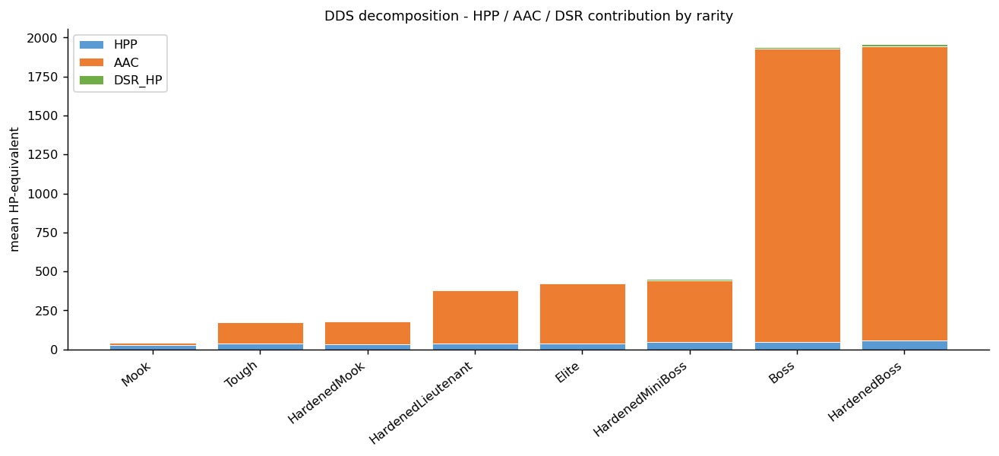

_Stacked HPP/AAC/DSR contribution to mean DDS per rarity. AAC dominance (driven by the SP=18 cap) makes HPP and DSR nearly invisible at higher tiers._

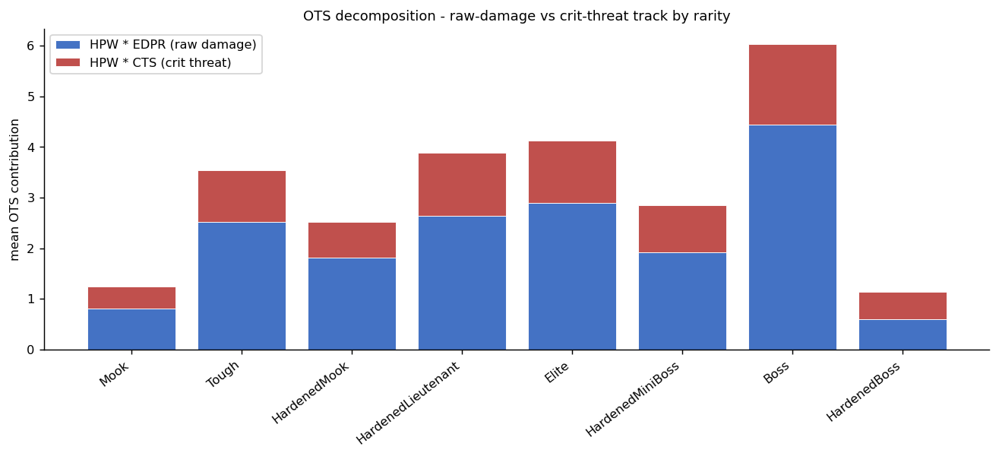

_Stacked HPW·EDPR vs HPW·CTS contribution to mean OTS per rarity. Crit-track dominance at low tiers means small-weapon NPCs are coasting on critical-hit luck._

### OTS zero-mass (penetration failure rate)

_P(EDPR_SS = 0) — how often a single shot from this rarity tier deals zero raw damage to this PC role. This unintended result stems from how weapon damage is being calculated. Using the mean of a die pool for a static damage value as a proxy isn't the correct approach._

| pc_role   | Mook  | Tough | HardenedMook | HardenedLieutenant | Elite | HardenedMiniBoss | Boss  | HardenedBoss |
| --------- | ----- | ----- | ------------ | ------------------ | ----- | ---------------- | ----- | ------------ |
| Exec      | 1.000 | 0.833 | 0.800        | 0.875              | 0.727 | 0.800            | 0.444 | 1.000        |
| Fixer     | 0.556 | 0.500 | 0.500        | 0.500              | 0.409 | 0.400            | 0.278 | 0.750        |
| Media     | 0.704 | 0.611 | 0.600        | 0.625              | 0.515 | 0.533            | 0.333 | 0.833        |
| Netrunner | 1.000 | 0.833 | 0.800        | 0.875              | 0.727 | 0.800            | 0.444 | 1.000        |
| Rockerboy | 1.000 | 0.833 | 0.800        | 0.875              | 0.727 | 0.800            | 0.444 | 1.000        |
| Solo      | 0.778 | 0.667 | 0.650        | 0.688              | 0.583 | 0.650            | 0.389 | 0.875        |
| Tech      | 0.704 | 0.611 | 0.600        | 0.625              | 0.515 | 0.533            | 0.333 | 0.833        |

_Source: [tables/ots_zero_mass.csv](tables/ots_zero_mass.csv)_

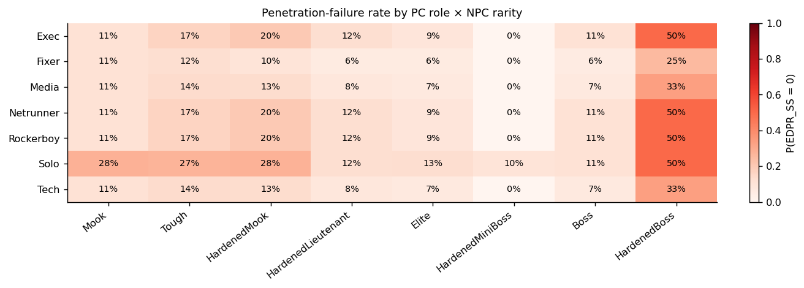

_Hot cells = NPC tier consistently fails to penetrate this PC role's armor. This supports the conclusion noted above. Flat mean damage values aren't nuanced enough to be used for determining armor penetration._

### Weighting sensitivity

_Spearman ρ of NPC rankings vs the 60/40 baseline under alternative OTS/DDS weightings. Top-10 changes count NPCs that enter or leave the top 10. Currently OTS doesn't have enough of an impact on the NTS score for this metric to provide valuable information._

| index | ots_weight | dds_weight | spearman_rho | top10_overlap | top10_changes |
| ----- | ---------- | ---------- | ------------ | ------------- | ------------- |
| 0     | 0.600      | 0.400      | 1.000        | 10            | 0             |
| 1     | 0.550      | 0.450      | 1.000        | 10            | 0             |
| 2     | 0.500      | 0.500      | 0.999        | 10            | 0             |

_Source: [tables/weighting_sensitivity.csv](tables/weighting_sensitivity.csv)_

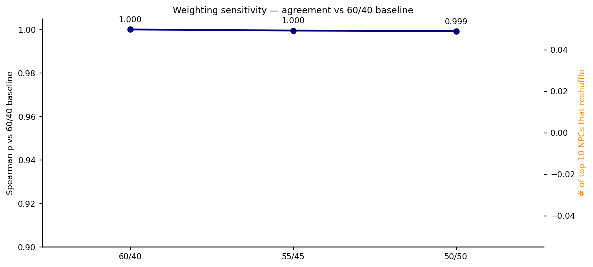

### Rank stability across PCs

- **PCs compared**: 16
- **Mean Spearman ρ**: 0.9953
- **Min Spearman ρ**: 0.9828
- **Max Spearman ρ**: 1.0

ρ ≈ 1 means every PC ranks the NPC roster the same way. ρ < 0.85 means some NPCs are dramatically more threatening to specific PCs.

### NPC threat consistency

_Top-15 NPCs by coefficient of variation of OTS across PCs (these are the most PC-dependent threats)._

| index | npc_id                      | npc_rarity         | ots_mean | ots_std | ots_cv |
| ----- | --------------------------- | ------------------ | -------- | ------- | ------ |
| 7     | NPC.Bozos_BurtTheSquirt     | HardenedMook       | 2.005    | 2.525   | 1.259  |
| 49    | NPC.NCPD_Cherub             | Tough              | 2.005    | 2.525   | 1.259  |
| 8     | NPC.Bozos_Centwit           | Elite              | 2.258    | 2.838   | 1.257  |
| 22    | NPC.DigitalDivas_Firewall   | Tough              | 2.258    | 2.838   | 1.257  |
| 23    | NPC.DigitalDivas_JoseQuispe | Tough              | 2.258    | 2.838   | 1.257  |
| 72    | NPC.TeamMonster_Nox         | Elite              | 2.258    | 2.838   | 1.257  |
| 66    | NPC.Sightseers_Glare        | Mook               | 1.506    | 1.892   | 1.256  |
| 26    | NPC.GenerationRed_Apex      | HardenedMook       | 1.506    | 1.892   | 1.256  |
| 87    | NPC.Zoners_Alpha            | Mook               | 1.506    | 1.892   | 1.256  |
| 39    | NPC.Maelstrom_Ghoul         | Mook               | 1.506    | 1.892   | 1.256  |
| 1     | NPC.6thStreet_Breacher      | Elite              | 1.506    | 1.892   | 1.256  |
| 68    | NPC.Sightseers_Swirl        | Mook               | 1.506    | 1.892   | 1.256  |
| 16    | NPC.DangerGal_DocMittens    | HardenedLieutenant | 2.511    | 3.152   | 1.255  |
| 64    | NPC.Sightseers_Endo         | Elite              | 2.511    | 3.152   | 1.255  |
| 60    | NPC.Network54_Stringer      | Tough              | 2.511    | 3.152   | 1.255  |

_Source: [tables/npc_consistency.csv](tables/npc_consistency.csv)_

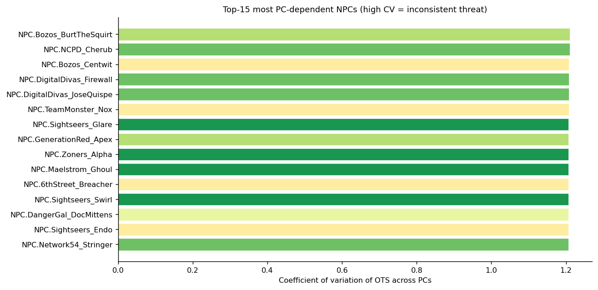

### SP-cap binding analysis

- **Unique NPCs**: 100
- **NPCs hitting SP=18 cap**: 0 (0.0%)
- **Max excess SP**: 0

| npc_rarity         | capped_npcs |
| ------------------ | ----------- |
| Mook               | 0           |
| Tough              | 0           |
| HardenedMook       | 0           |
| HardenedLieutenant | 0           |
| Elite              | 0           |
| HardenedMiniBoss   | 0           |
| Boss               | 0           |
| HardenedBoss       | 0           |

_Source: [tables/sp_cap_by_rarity.csv](tables/sp_cap_by_rarity.csv)_

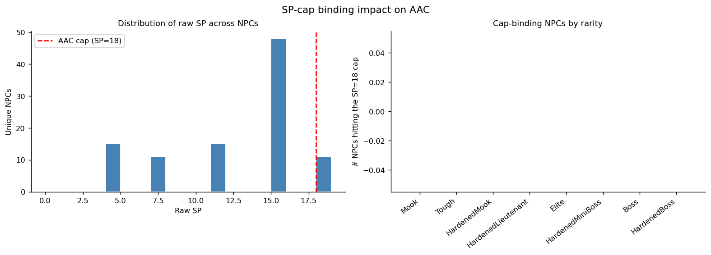

_Left: distribution of raw SP. Right: NPCs hitting the SP=18 cap, by rarity._

### Top extreme-tail NPCs and their drivers

_Top 10 NPCs by NTS_raw with the dominant subcomponent driver attributed (HPP/AAC/DSR/EDPR-track/CTS-track). It is easy to observe that DDS is the dominant driver of NTS_raw._

| index | npc_id                          | pc_role_id               | npc_rarity       | nts_raw | ots    | dds     | weapon_type     | driver |
| ----- | ------------------------------- | ------------------------ | ---------------- | ------- | ------ | ------- | --------------- | ------ |
| 0     | NPC.Maelstrom_Crusher           | NPC.Edgerunners_Leverage | HardenedBoss     | 97.691  | 0.297  | 243.782 | Flamethrower    | aac    |
| 1     | NPC.Zoners_Tearjerker           | NPC.Edgerunners_Leverage | Boss             | 93.820  | 16.817 | 209.324 | GrenadeLauncher | aac    |
| 2     | NPC.TygerClaws_ShinobuTheSecond | NPC.Edgerunners_Hammer   | Boss             | 92.977  | 8.412  | 219.824 | VeryHeavyMelee  | aac    |
| 3     | NPC.Maelstrom_Warlock           | NPC.Edgerunners_Flasher  | Boss             | 90.948  | 3.363  | 222.324 | Shotgun         | aac    |
| 4     | NPC.Bozos_Blammo                | NPC.Edgerunners_Hammer   | Boss             | 85.427  | 25.230 | 175.724 | RocketLauncher  | aac    |
| 5     | NPC.Zoners_Vanisher             | NPC.Edgerunners_Leverage | Boss             | 84.455  | 8.557  | 198.301 | HeavySMG        | aac    |
| 6     | NPC.Piranhas_BazookaJoe         | NPC.Edgerunners_CrabLord | Boss             | 81.872  | 0.238  | 204.324 | Brawling        | aac    |
| 7     | NPC.Bozos_BigTop                | NPC.Edgerunners_Crasher  | HardenedBoss     | 78.465  | 4.293  | 189.724 | HeavyMelee      | aac    |
| 8     | NPC.Maelstrom_ThePit            | NPC.Edgerunners_Leverage | HardenedMiniBoss | 77.394  | 6.729  | 183.392 | VeryHeavyPistol | aac    |
| 9     | NPC.Maelstrom_Quake             | NPC.Edgerunners_Leverage | HardenedMiniBoss | 72.577  | 8.412  | 168.824 | VeryHeavyMelee  | aac    |

_Source: [tables/extreme_tail_npcs.csv](tables/extreme_tail_npcs.csv)_

### Sample sizes by rarity

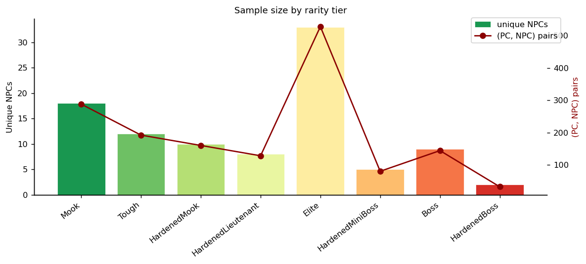

## 7. Recommend

> Prioritized action plan tied to outline.md's open calibration parameters.

**Executive summary:** 1 critical issue(s), 3 warning(s), 2 item(s) to monitor, 3 confirmed-healthy signal(s). Lead issue: _HardenedLieutenant↔Elite: Tiers Are Statistically Indistinguishable._ SCALE_FACTOR is confirmed at 5.00. Fix the tier-separation and AAC-dominance issues before treating NTS values as authoritative.

### Priority 1 — Critical (Fix Before Use)

#### ❌ HardenedLieutenant↔Elite: Tiers Are Statistically Indistinguishable

**Issue:** The HardenedLieutenant and Elite tiers have 100.0% distributional overlap in NTS_raw (Cohen's d = 0.271). These two rarity levels cannot be told apart by NTS — assigning either label produces the same encounter difficulty.

**Root cause:** AAC accounts for >70% of DDS at upper tiers. Both tiers likely share similar SP values, compressing their DDS ranges toward the same ceiling regardless of stat differences. HPP and DSR contribute too little to produce separation when AAC dominates.

**Action:**
- Audit SP assignments for HardenedLieutenant and Elite NPCs — verify they differ meaningfully.
- If SP is already differentiated, raise HPP via BODY/WILL stat increases for Elite NPCs.
- Address AAC dominance via formula rebalancing (see WARNING section) — this amplifies the effect of any stat differences.
- Target: Cohen's d ≥ 0.8 and overlap < 30% for this boundary.

**Expected outcome:** After corrections, HardenedLieutenant and Elite should occupy clearly distinct NTS bands, making rarity labels meaningful for encounter composition.

### Priority 2 — Warning (Address Before Relying on Ratings)

#### ⚠️ Tough↔HardenedMook: Weak Tier Boundary (d=0.177, overlap=74.0%)

**Issue:** The Tough↔HardenedMook boundary has 74.0% distributional overlap (Cohen's d = 0.177). NPCs near this boundary receive interchangeable NTS values across tiers — meaningful but not yet collapsed.

**Root cause:** The stat-block delta between Tough and HardenedMook is not large enough to overcome within-tier variance. AAC dominance in DDS suppresses NTS sensitivity to HP-pool differences.

**Action:**
- Widen the stat gap: lower the Tough stat ceiling or raise the HardenedMook floor.
- Consider whether 'Tough' is a distinct design tier or should be merged with 'HardenedMook'.
- Rebalancing AAC in the DDS formula (see AAC recommendation) will increase the leverage of BODY/WILL differences.

**Expected outcome:** Target Cohen's d ≥ 0.8 and overlap < 40% for the Tough↔HardenedMook boundary.

#### ⚠️ AAC Dominates DDS at Upper Tiers — HPP and DSR Are Noise

**Issue:** At ['HardenedLieutenant', 'Elite', 'HardenedMiniBoss', 'Boss', 'HardenedBoss'], Armor Absorption Capacity accounts for up to 69% of mean DDS. Hit Point Pool (HPP) and Death Save Resilience (DSR) contribute so little that BODY and WILL stat differences between tiers have almost no effect on NTS.

**Root cause:** The AAC formula uses a triangular sum (SP + SP-1 + … + 1), which grows as SP²/2. At high SP values this vastly outweighs the linear HPP formula (BODY×5 + 10). The `SP_CAPPED` parameter (currently 18) matches the highest observed SP in the dataset, so it is not binding — adjusting it would not affect current data.

**Action:**
- Add a configurable `HPP_weight` multiplier to the DDS formula (e.g., `DDS = HPP * HPP_weight + AAC + DSR_hp`) so HPP can be scaled up relative to AAC.
- Alternatively, apply a square-root or log transform to AAC before summing to reduce its curvature at high SP values.
- Re-run the EDA after any formula change — target aac_share < 50% at Elite tier.

**Expected outcome:** Once HPP and DSR contribute ≥ 30% of DDS, stat-block differences between tiers will produce larger NTS gaps, likely resolving several weak-boundary issues as a side effect.

#### ⚠️ SCALE_FACTOR: Set to 5.00 — 75% Anchor Hit Rate

**Issue:** The optimal SCALE_FACTOR is 5.00, which lands 75% of anchor tiers inside their target NTS bands. Misses: Tough → NTS 5 (target 1-4), HardenedLieutenant → NTS 10 (target 5-8). Until this is explicitly set in the codebase, all NTS outputs are uncalibrated.

**Root cause:** The Tough tier median NTS_raw (≈29.75) overshoots its target band (NTS 1–4) even at SCALE_FACTOR=6.0. This is a downstream symptom of the Tough↔HardenedMook boundary weakness — the two tiers are too close in score for both to land in separate bands.

**Action:**
- Set `SCALE_FACTOR = 5.00` in the codebase now as a baseline.
- Retest the anchor hit rate after addressing Tough↔HardenedMook stat separation — the hit rate should improve once tier scores diverge.

**Expected outcome:** After tier separation fixes, expect the anchor hit rate to rise above 87% at SCALE_FACTOR=5.00.

### Priority 3 — Monitor (No Immediate Action)

#### 🔍 OTS Zero-Mass: Low-Tier NPCs Fail to Penetrate Light-PC Armor

**Issue:** In single-shot mode, ≥80% of attacks from low-tier NPCs deal zero raw damage to several PC roles — these NPCs are crit-only threats with no consistent damage output. Examples: Mook: Exec (100%), Netrunner (100%); Tough: Exec (83%), Netrunner (83%); HardenedMook: Exec (80%), Netrunner (80%).

**Root cause:** Light-armor PCs (Exec, Rockerboy, Netrunner) have SP high enough to fully absorb average Mook/Tough weapon damage. This is a game-mechanic outcome, not a formula error — but it means low-tier NPCs are essentially harmless to some PCs except on lucky criticals.

**Action:**
- No formula change required at this time — this reflects intended armor economy.
- Monitor during playtesting: if Mook encounters feel trivially safe for armored PCs, consider whether Mooks should include more autofire-capable weapons.
- Track this metric as NPC stat blocks are expanded — rising zero-mass rates signal armor creep.

**Expected outcome:** This is a design tension to be managed at the encounter-composition level, not a calibration fix.

#### 🔍 Data Quality: 16% of NPCs Missing Clean Metadata

**Issue:** 16/100 NPCs could not be matched to the clean metadata file and have no weapon_type, faction, or name in stratified analyses. Faction and rarity breakdowns in Sections 5–6 may be systematically biased.

**Root cause:** The fuzzy join between `nts_raw_scores.json` and `npc_data_clean.json` failed for these NPCs — likely due to naming inconsistencies (capitalization, punctuation, or faction prefix format mismatches).

**Action:**
- Identify the unmatched NPC IDs: run `data.join_clean_npcs()` with verbose=True or inspect the rows where `npc_name` is null.
- Manually reconcile the naming in either JSON file for the affected NPCs.
- Rerun the EDA — faction and rarity breakdowns may shift once all NPCs are matched.

**Expected outcome:** Full join coverage (100%) will make faction and rarity stratifications reliable. The 84% match rate is acceptable for calibration estimates but should be resolved before treating faction-level findings as actionable.

### Confirmed Healthy

#### ✅ 60/40 OTS/DDS Weighting Is Stable

**Issue:** Switching from 60/40 to 55/45 yields Spearman ρ=0.9995 vs baseline; 0.0/10 top-tier NPCs reshuffle. The weighting choice does not materially affect NPC rankings.

**Root cause:** N/A — this is a confirmed healthy signal.

**Action:**
- Keep the 60/40 split. No change needed.

**Expected outcome:** NTS rankings remain consistent regardless of minor weight adjustments.

#### ✅ Cross-PC Rank Stability Is Strong

**Issue:** Mean Spearman ρ=0.9953, min ρ=0.9828 across all 16 PC pairings. Every PC ranks the NPC roster nearly identically.

**Root cause:** N/A — this is a confirmed healthy signal.

**Action:**
- No change needed. The headline NTS integer is a fair single-number summary.

**Expected outcome:** A single NTS value per NPC will accurately represent difficulty across all PC roles.

#### ✅ SP_CAPPED Ceiling Is Not Currently Binding

**Issue:** 0/100 NPCs exceed the SP_CAPPED threshold (0.0%). The parameter has no effect on current data.

**Root cause:** N/A — this is a confirmed healthy signal.

**Action:**
- No change needed now.
- Revisit if future NPC stat blocks include SP values above the current threshold.

**Expected outcome:** SP_CAPPED remains a dormant calibration knob until higher-SP NPCs are added.
